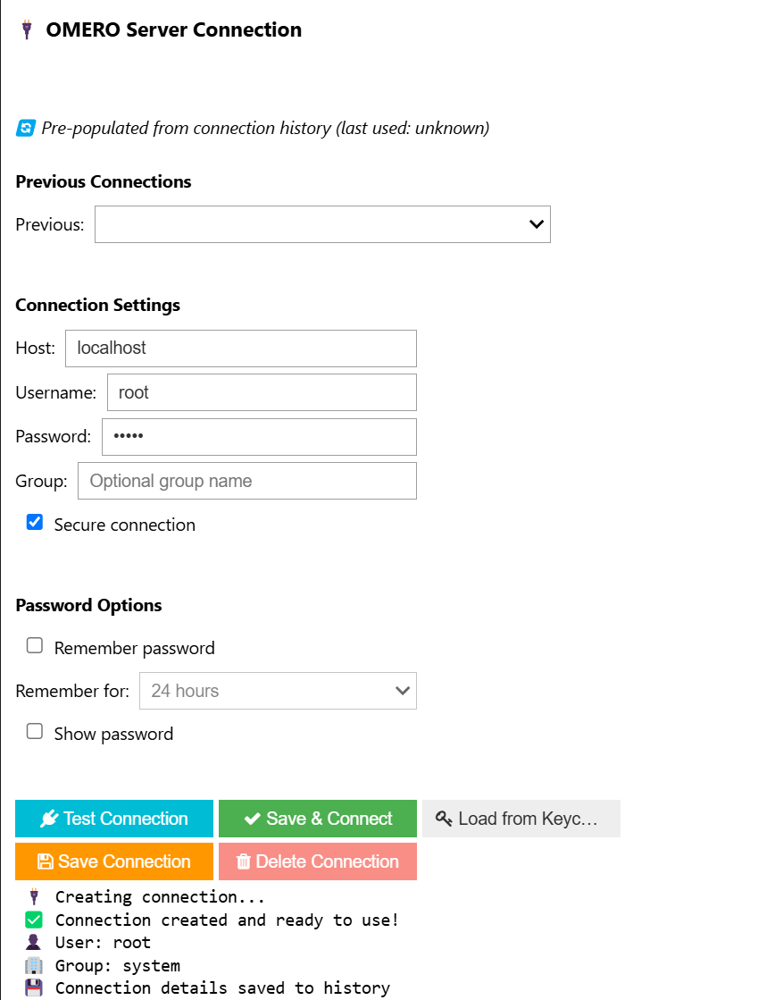
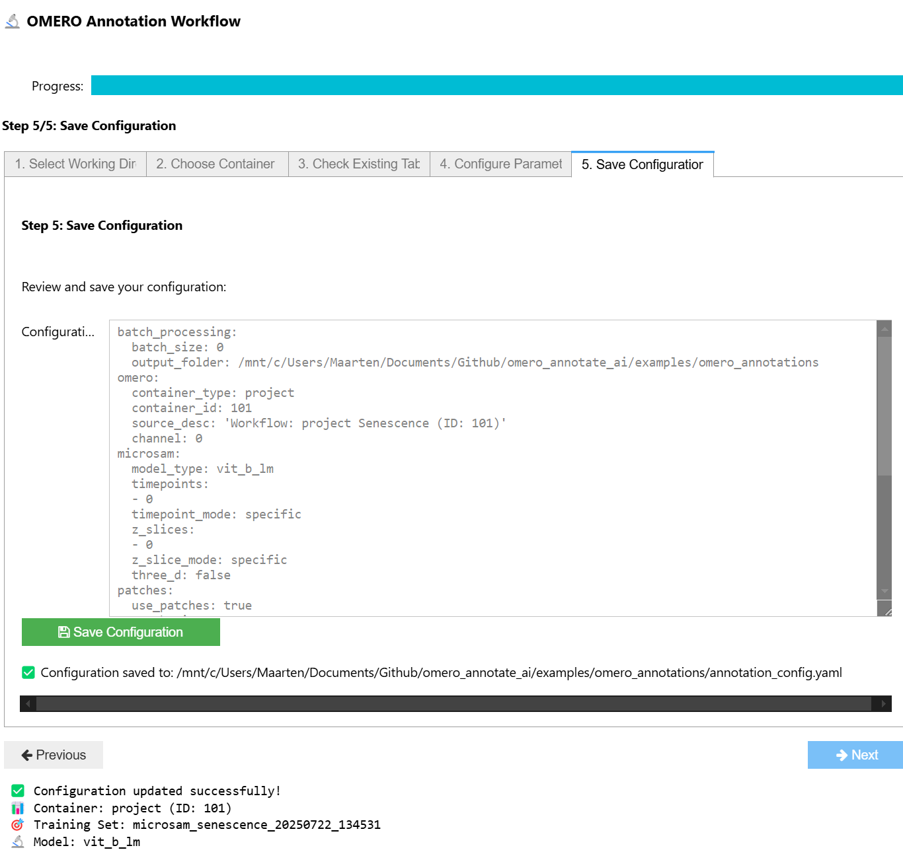

# OMERO AI Annotation tools

This package provides tools for image analysis and AI training with OMERO data. It is specifically designed to work with the [micro-SAM](https://github.com/computational-cell-analytics/micro-sam) annotator plugin in napari. It simplifies the process of connecting to an OMERO server, configuring annotation workflows, and running AI models on image data using jupyter notebook widgets. 

## Installation

This package has dependencies that are only available through conda (micro-sam) and requires platform-specific wheels (zeroc-ice). We recommend using **pixi** for the best installation experience, but conda/pip installation is also supported.

### 🚀 Recommended: Pixi Installation

[Pixi](https://pixi.sh/latest/) automatically handles all dependencies including conda packages and platform-specific wheels.

1. **Install pixi** (if not already installed):
   ```bash
   # On Windows (PowerShell)
   iwr -useb https://pixi.sh/install.ps1 | iex
   
   # On macOS/Linux
   curl -fsSL https://pixi.sh/install.sh | bash
   ```

2. **Clone and install**:
   ```bash
   git clone https://github.com/Leiden-Cell-Observatory/omero_annotate_ai.git
   cd omero_annotate_ai
   pixi install
   ```

3. **Activate the environment**:
   ```bash
   pixi shell
   ```

That's it! All dependencies (micro-sam, napari, zeroc-ice, etc.) are automatically installed and configured.

### 🐍 Alternative: Conda + Pip Installation

If you prefer conda, you'll need to manually install some dependencies:

1. **Create conda environment**:
   ```bash
   conda create -n omero_annotate_ai python=3.12
   conda activate omero_annotate_ai
   ```

2. **Install conda-only dependencies**:
   ```bash
   conda install -c conda-forge micro-sam napari
   ```

3. **Install platform-specific zeroc-ice wheel**:
   ```bash
   # Linux x86_64
   pip install https://github.com/glencoesoftware/zeroc-ice-py-linux-x86_64/releases/download/20240202/zeroc_ice-3.6.5-cp312-cp312-manylinux_2_28_x86_64.whl
   
   # Windows x86_64
   pip install https://github.com/glencoesoftware/zeroc-ice-py-win-x86_64/releases/download/20240325/zeroc_ice-3.6.5-cp312-cp312-win_amd64.whl
   
   # macOS (Universal)
   pip install https://github.com/glencoesoftware/zeroc-ice-py-macos-universal2/releases/download/20240131/zeroc_ice-3.6.5-cp312-cp312-macosx_11_0_universal2.whl
   ```

4. **Install the package**:
   ```bash
   # From PyPI (when released)
   pip install omero-annotate-ai[microsam]
   
   # Or from source
   git clone https://github.com/Leiden-Cell-Observatory/omero_annotate_ai.git
   cd omero_annotate_ai
   pip install -e .[microsam]
   ```

### 📦 PyPI Installation (Basic Features Only)

For basic OMERO functionality without AI features:

```bash
pip install omero-annotate-ai
```

**Note**: This installs core functionality only. For AI annotation features, you'll need micro-sam which requires conda or pixi installation.

### Development Installation

For contributors:

```bash
# With pixi (recommended)
git clone https://github.com/Leiden-Cell-Observatory/omero_annotate_ai.git
cd omero_annotate_ai
pixi install
pixi run pytest  # Run tests

# With conda
conda create -n omero_annotate_ai-dev python=3.12
conda activate omero_annotate_ai-dev
conda install -c conda-forge micro-sam napari
pip install -e .[dev,microsam]
```

### Troubleshooting

- **zeroc-ice issues**: Use the specific wheel URLs above for your platform
- **micro-sam not found**: This package is conda-only, use pixi or conda installation
- **Permission errors**: On some systems, you may need to run with `--user` flag for pip installs

### Quick Start

After installation, start a Jupyter environment:

```bash
# With pixi
pixi run jupyter lab

# With conda
conda activate omero_annotate_ai
jupyter lab
```

## Usage

### OMERO Connection widget
   

This widget allows you to connect to an OMERO server by providing the server URL, username, and password. It provides a simple interface to authenticate and to store credentials locally.

### Annotation Pipeline widget
 . This widget allows you to define the annotation pipeline and configure the parameters for the micro-SAM annotator.

### Annotation Config .YAML file
The Annotation pipeline widget uses a configuration file to define the annotation workflow. The configuration file is a YAML file that defines the parameters for the annotation pipeline, including the Dataset ID in OMERO, the number of images to process and the dimensions of the images. 

### Running the Annotation Pipeline
The annotation pipeline takes the configuration file and runs the annotation workflow. It connects to the OMERO server, retrieves the images, and runs the annotation pipeline on the images. It will run the micro-sam series annotator in OMERO and automatically stores the annotations back into OMERO as label images. The results are stored in the OMERO server as an annotation table.

### 🔬 3D Volumetric Annotation Support

The package supports both 2D slice-by-slice and 3D volumetric annotation modes controlled by the `three_d` field:

**2D Mode (Default)**:
- `three_d: false` (default)
- Each z-slice processed individually
- One table row per z-slice
- Compatible with existing workflows

**3D Volumetric Mode**:
- `three_d: true`
- Process entire z-stacks as volumes
- One table row per volume
- Better for 3D structures and objects

#### 3D Configuration Example:
```yaml
spatial_coverage:
  three_d: true               # Enable 3D volumetric mode
  z_range_start: 0            # Start of volume
  z_range_end: 10             # End of volume
  z_slices: [0, 1, 2, 3, 4, 5, 6, 7, 8, 9, 10]  # Alternative to z_range
```

#### 3D Table Schema:
3D mode adds new fields to annotation tables:
- `z_start` - Starting z-slice of volume
- `z_end` - Ending z-slice of volume  
- `z_length` - Number of z-slices in volume
- `is_volumetric` - Boolean flag for volume processing

See `examples/omero-annotate-ai-3d.ipynb` for detailed 3D workflow examples.

## Example notebooks

### omero-annotate-ai-pipeline.ipynb
This example notebook demonstrates how to use the OMERO Annotate AI tools to run the annotation pipeline. It includes steps to connect to the OMERO server, configure the annotation pipeline, and run the full annotation workflow.

### omero-annotate-ai-from-yaml.ipynb
This examples notebook demonstrates how to run the annotation pipeline using a yaml file directly and run the annotation pipeline.

### omero-annotate-ai-3d.ipynb
This example notebook demonstrates 3D volumetric annotation capabilities. It shows how to configure and run 3D workflows, compare 2D vs 3D processing modes, and work with the enhanced 3D table schema.

### cleanup_annotation.ipynb
This example notebook demonstrates how to clean up annotations in an OMERO project or dataset. It includes steps to list all annotation tables in a project or dataset, delete specific annotation tables, and confirm the deletion. This is useful for managing annotations and ensuring that only relevant annotations are kept in the OMERO server.

## Contact
For questions, reach out to Maarten Paul (m.w.paul@lacdr.leidenuniv.nl). For issues or suggestions, please use the Issues section of the GitHub repository.

## Acknowledgments
This repository is developed with the NL-BioImaging intrastructure, funded by NWO (National Roadmap for Large-Scale Research Facilities).
