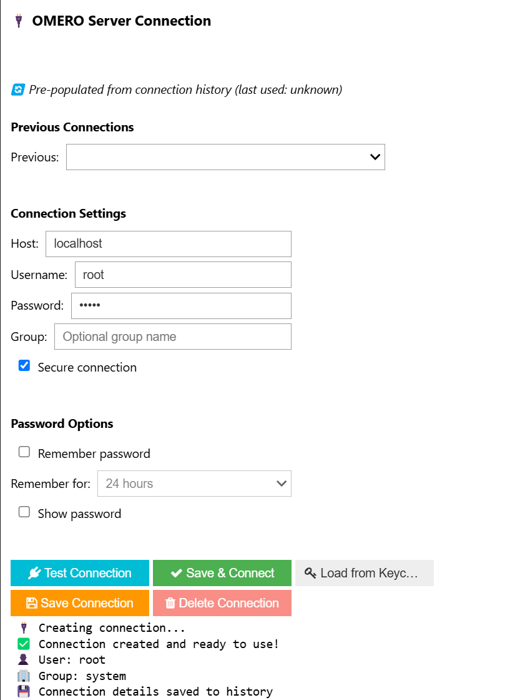
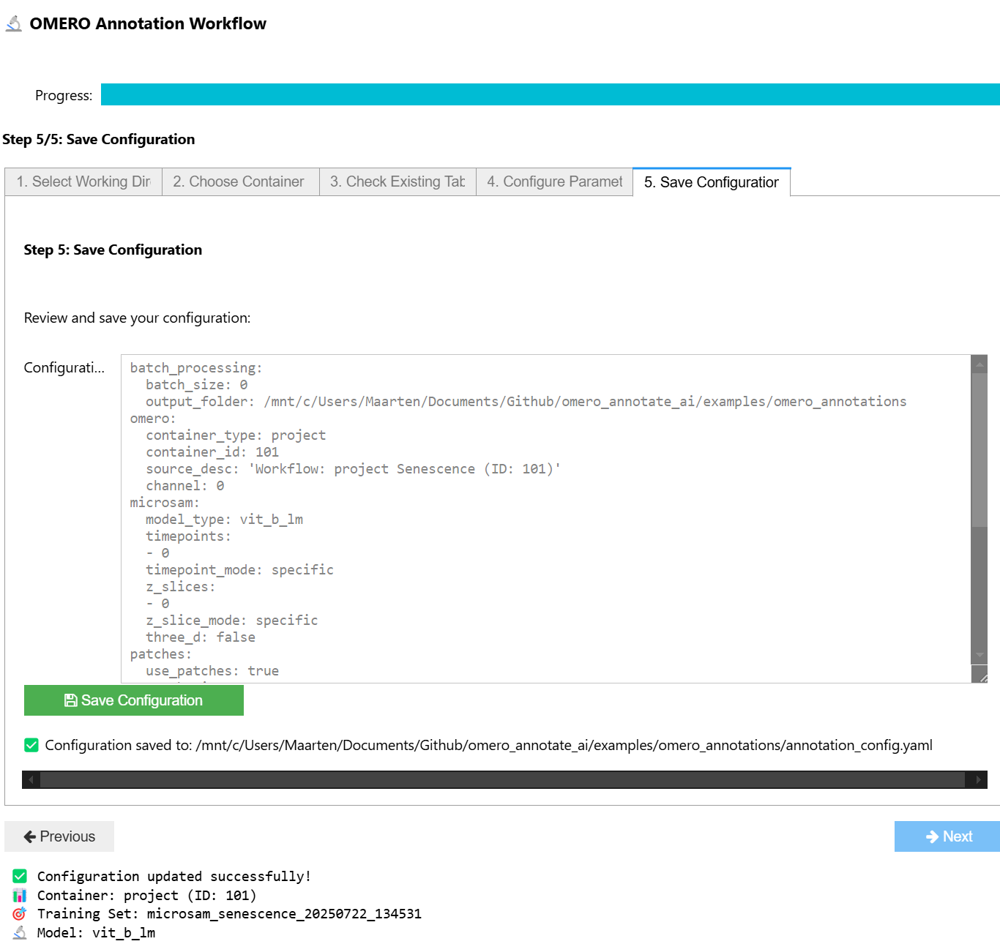

# OMERO Annotate.AI


OMERO annotate.AI is a Python package that provides tools for reproducible AI workflows (annotation, training and inference) using OMERO (Open Microscopy Environment) data repositories. The package directly connects OMERO datasets with AI dataset annotation tools such as micro-sam annotator tool in napari.

## Key Features

* **OMERO connection and annotation workflow widgets** within Jupyter notebooks
* **Pydantic model validated YAML configuration files** to track the annotation and training workflow
* **Direct integration of micro-SAM annotation** of OMERO data
* **Saving annotations and annotation configuration** back into OMERO (OMERO.table, YAML)
* **Preparation of training data** for Biapy and DL4MicEverywhere
* **3D volumetric annotation support** for z-stack processing
* **Reproducible AI workflows** with detailed tracking and validation

## Workflows Supported

### Interactive Widget Workflows
- **OMERO Connection Widget** - Secure connection to OMERO servers with credential management
- **Annotation Pipeline Widget** - Visual configuration of annotation workflows
- **Progress Tracking** - Real-time monitoring of annotation progress


*OMERO connection widget for secure server authentication*

  
*Annotation pipeline widget for visual workflow configuration*

### Annotation Workflows
- **Interactive widget-based annotation** using OMERO connection and workflow widgets
- **YAML configuration-driven annotation** for reproducible batch processing  
- **micro-SAM assisted annotation** with automatic segmentation
- **Cellpose integration** for cell segmentation workflows
- **3D volumetric annotation** for z-stack data

### Training Workflows  
- **BiaPy integration** for deep learning model training
- **DL4MicEverywhere compatibility** for cloud-based training
- **Training data preparation** with automatic train/validation splits
- **micro-SAM model fine-tuning** on custom datasets

### Quality Control
- **Annotation validation** and quality metrics
- **Progress tracking** with detailed status reporting
- **Resume functionality** from previous annotation sessions

## Quick Start

For a quick start, see our [Installation Guide](installation.md) for detailed setup instructions.

### Basic 2-Widget Workflow

```python
from omero_annotate_ai import create_omero_connection_widget, create_workflow_widget, create_pipeline

# Step 1: Connect to OMERO
conn_widget = create_omero_connection_widget()
conn_widget.display()
conn = conn_widget.get_connection()

# Step 2: Configure workflow
workflow_widget = create_workflow_widget(connection=conn)
workflow_widget.display()
config = workflow_widget.get_config()

# Step 3: Run pipeline
pipeline = create_pipeline(config, conn)
table_id, processed_images = pipeline.run_full_workflow()
```

### Configuration-Based Workflow

```python
from omero_annotate_ai.core.annotation_config import load_config
from omero_annotate_ai.core.annotation_pipeline import create_pipeline
from omero_annotate_ai.omero.simple_connection import create_connection

# Load configuration from YAML
config = load_config("annotation_config.yaml")

# Connect to OMERO
conn = create_connection(host="omero.server.com", user="username")

# Run annotation pipeline  
pipeline = create_pipeline(config, conn)
results = pipeline.run_full_workflow()
```

## User Guides

### Getting Started
- [Installation Guide](installation.md) - Complete setup instructions and troubleshooting
- [Widget Tutorial](tutorials/microsam-annotation-pipeline.md) - Interactive widget workflow
- [YAML Configuration Guide](configuration.md) - Complete YAML configuration reference
- [YAML Configuration Tutorial](tutorials/batch-processing.md) - Configuration file workflow

### Step-by-Step Tutorials

<div class="tutorial-card">
<h3>🚀 micro-SAM Annotation Pipeline</h3>
<span class="status-badge complete">Complete</span>
<p>Complete workflow tutorial covering OMERO connection, configuration, and micro-SAM annotation execution.</p>
<p><a href="tutorials/microsam-annotation-pipeline.md" class="md-button">Start Tutorial</a></p>
</div>

<div class="tutorial-card">
<h3>🔬 Cellpose Integration</h3>
<span class="status-badge planned">Planned</span>
<p>Learn to use Cellpose models for cell segmentation workflows within the OMERO framework.</p>
<p><a href="tutorials/cellpose-integration.md" class="md-button">View Tutorial</a></p>
</div>

<div class="tutorial-card">
<h3>📊 Training Data Preparation</h3>
<span class="status-badge planned">Planned</span>
<p>Prepare high-quality training datasets from OMERO annotations for machine learning model development.</p>
<p><a href="tutorials/training-data-prep.md" class="md-button">View Tutorial</a></p>
</div>

<div class="tutorial-card">
<h3>🧠 BiaPy Integration</h3>
<span class="status-badge planned">Planned</span>
<p>Train custom deep learning models using BiaPy with data prepared from OMERO annotations.</p>
<p><a href="tutorials/biapy-integration.md" class="md-button">View Tutorial</a></p>
</div>

<div class="tutorial-card">
<h3>⚡ Batch Processing Guide</h3>
<span class="status-badge planned">Planned</span>
<p>Scale up your annotation workflows for large datasets with efficient batch processing strategies.</p>
<p><a href="tutorials/batch-processing.md" class="md-button">View Tutorial</a></p>
</div>

### Advanced Workflows
- [3D Volumetric Annotation](tutorials/microsam-annotation-pipeline.md#3d-volumetric-processing) - Processing z-stack data 
- [Training with BiaPy](tutorials/biapy-integration.md) - Deep learning model training
- [DL4MicEverywhere Integration](tutorials/training-data-prep.md) - Cloud training workflows

### Configuration Reference
- [YAML Configuration Schema](configuration.md) - Complete configuration options and examples

## Community & Support

- [GitHub Repository](https://github.com/Leiden-Cell-Observatory/omero_annotate_ai) - Source code and development
- [Issue Tracker](https://github.com/Leiden-Cell-Observatory/omero_annotate_ai/issues) - Bug reports and feature requests
- [PyPI Package](https://pypi.org/project/omero-annotate-ai/) - Release downloads and installation
- [NL-BioImaging](https://github.com/NL-BioImaging) - Supporting infrastructure
